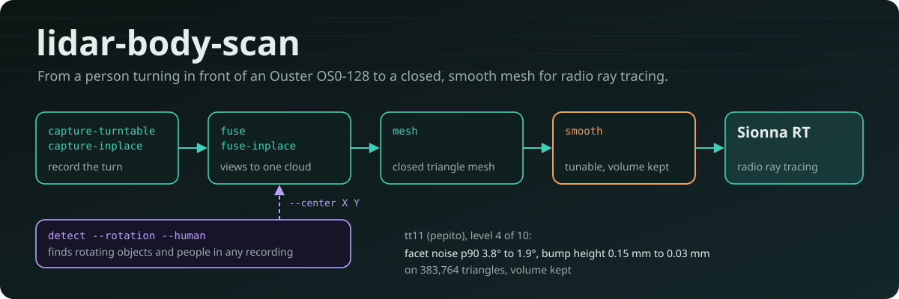
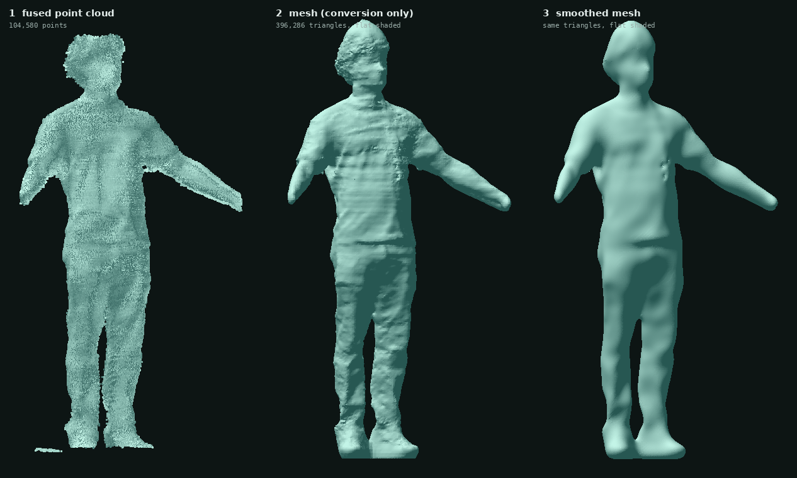
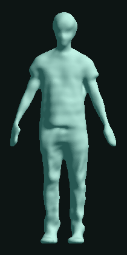
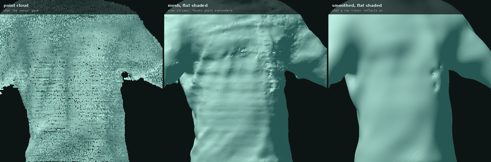
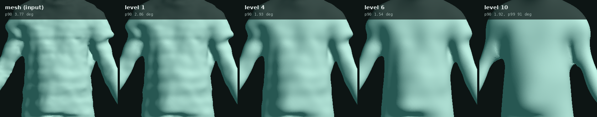

<div align="center">



<br>


**[Idea](#the-idea-in-one-picture)** ·
**[Features](#features)** ·
**[Gallery](#gallery)** ·
**[Install](#installation)** ·
**[Quick start](#quick-start-without-the-sensor)** ·
**[Usage](#usage)** ·
**[Docs](#documentation)**

</div>

---

## The idea in one picture

A person stands on a motorized turntable (or turns on the spot by small steps) in front of an Ouster OS0-128 LiDAR. The sensor sees one side at a time. This package **fuses the views into one point cloud**, **converts it into a closed triangle mesh**, and **smooths the scan stripes away**, so that a radio ray tracer (Sionna RT) can bounce rays off the body.

<p align="center">
  
</p>

<p align="center"><sub>Real data, run <code>tt16</code>. Left: the fused cloud. Middle: the mesh straight from the conversion. Right: the same triangles after <code>smooth</code>. Both meshes are drawn with flat shading, which is what a ray tracer reflects on.</sub></p>

Why the last step matters: at 60 GHz the wavelength is 5 mm, and a surface looks smooth to the wave when its bumps stay under λ/8 = 0.62 mm. A raw scan has stripes a few millimetres tall, so triangle normals point in many directions and reflected rays scatter. The working assumption of this project is that Sionna RT reflects on the face normals, so the geometry itself has to be smooth (this assumption has not been checked against Sionna).

<p align="center">
  
</p>

<p align="center"><sub>The smoothed mesh of <code>tt16</code>. An interactive 3D version is in <a href="docs/models/person_tt16_smooth_preview.stl"><code>docs/models/person_tt16_smooth_preview.stl</code></a>: GitHub opens it in a 3D viewer you can rotate (60,000 triangles, decimated for the preview).</sub></p>

---

## Features

| | |
|---|---|
| **Capture** | Records a standing person on a motorized turntable, or turning in place by small steps. The motor can be driven from this PC (serial) or from another PC with the included MATLAB script. A short empty-scene recording and a countdown are part of the sequence. |
| **View check** | `check-view` tells you, before recording, whether head and feet are inside the vertical field of view, the best sensor tilt, and the smallest gap the sensor can see at the person. |
| **Fusion** | Finds the platform centre from its ring, estimates the platform angle for every frame, and fuses the views into one cloud with normals and a per-point confidence. |
| **Mesh** | Poisson reconstruction, a closed manifold remesh on a 4 mm grid, flat soles, and a quality report: facet normal noise, bump height against λ/8 and λ/32, distance to the cloud. No smoothing is applied here. |
| **Smooth** | Normal filtering, then vertex update, then volume restoration, repeated for the rounds you choose. Every parameter is direct: scale, rounds, finishing rounds, normal sigma, deviation limit. `--sweep` writes one mesh per value to compare. |
| **Detect** | Finds objects rotating about a vertical axis and objects shaped like a standing person in any recording, and gives their centres. |
| **Reproducible** | Every run writes a JSON report with the complete configuration. Settings come from options, TOML/JSON files, or `--set section.name=value`. |
| **Light install** | Only numpy and open3d for the processing. scipy is not used. Works with the Python that MATLAB uses, for PCs where software can only be installed through MATLAB. |
| **Tested** | Unit and end-to-end tests on synthetic recordings, and a `simulate` command that makes them without the sensor. |

---

## Gallery

### What smoothing does to the surface

<p align="center">
  
</p>

The scan rows leave horizontal stripes. In the middle panel every stripe tilts the triangles up or down, and a ray bouncing there would be deflected by twice the tilt. In the right panel the stripes are gone and the body shape is kept.

Measured on the whole `tt16` body (396,286 triangles), with the default settings:

| | before `smooth` | after `smooth` |
|---|---|---|
| facet normal noise, median | 3.59° | 0.64° |
| facet normal noise, 90th percentile | 13.07° | 1.98° |
| bump height, rms | 0.479 mm | 0.307 mm |
| distance moved from the input | none | median 1.02 mm, 99th percentile 5.35 mm, max 9.71 mm |
| volume | 98.71 l | kept |

### Choosing the strength

`smooth` has no fixed levels: you set the parameters. The images show ten settings of one scan (`tt11`), from the lightest to the strongest; six of them are drawn here. Step 8 has the lowest 90th percentile. Step 10 is stronger but worse: 1 % of its facets are tilted by more than 91° and some vertices move 26 mm.

<p align="center">
  
</p>

| Step | scale | rounds | finishing | facet noise p90 | facet noise p99 | largest move |
|---|---|---|---|---|---|---|
| input | none | none | none | 3.77° | 18.33° | 0 mm |
| 1 | 6 mm | 1 | none | 2.86° | 6.68° | 3.1 mm |
| 3 | 12 mm | 1 | 2 at 6 mm | 2.13° | 5.08° | 5.8 mm |
| 5 | 12 mm | 4 | 2 at 6 mm | 1.72° | 5.10° | 8.6 mm |
| 8 | 16 mm | 8 | 2 at 6 mm | **1.46°** | 11.13° | 18.2 mm |
| 10 | 24 mm | 8 | 2 at 6 mm | 1.92° | 90.82° | 26.2 mm |

Read the 99th percentile and the largest move together with the median, not only the median. [docs/tuning.md](docs/tuning.md) explains every parameter, organised by symptom.

### The files you get

Every command writes plain `.ply` files that open in MeshLab, CloudCompare or Blender. To look at one from Python:

```
python -c "import open3d as o3d; o3d.visualization.draw_geometries([o3d.io.read_triangle_mesh(r'C:\lidar\person_tt17_smooth.ply')])"
```

| File | What it is | How it looks |
|---|---|---|
| `person_tt17_views.ply` | every view in its own colour | the raw material, one colour per sensor view |
| `person_tt17.ply` | the fused point cloud with normals, z = 0 at the platform top | the left picture above |
| `person_tt17_confidence.ply` | the same cloud with, per point, the number of views, points and spread | where the cloud can be trusted |
| `person_tt17_mesh.ply` | the closed mesh, no smoothing | the middle picture above |
| `person_tt17_smooth.ply` | the smoothed mesh | the right picture above, the file for Sionna RT |
| `*_quality.json` | facet noise, bump height, distance moved | the numbers in the table above |

---

## Installation

Only numpy and open3d are needed for the processing; matplotlib (plots) is optional; ouster-sdk is needed only to record (and pyserial only when this PC drives the motor). scipy is not used.

On a PC where new software can only be installed through MATLAB, use the Python that MATLAB uses (`pyenv` in MATLAB shows it) and install the packages for it from MATLAB's Add-On Explorer or with that interpreter. Nothing has to be installed for the package itself: clone the repository and run the commands from its folder.

```
git clone https://github.com/cocopops9/lidar-body-scan.git
cd lidar-body-scan
python -m bodyscan --help
```

Three equivalent ways to run a command:

- command prompt in the repository folder: `python -m bodyscan fuse C:\lidar\tt17`
- from any folder: `C:\path\to\lidar-body-scan\bodyscan.bat fuse C:\lidar\tt17` (set `BODYSCAN_PYTHON` to MATLAB's python.exe if it is not on PATH)
- from MATLAB, with the Python configured in `pyenv`: `addpath('C:\path\to\lidar-body-scan\matlab'); bodyscan('fuse', 'C:\lidar\tt17')`

Python 3.9 or later (tested with 3.11). Configuration files in TOML need Python 3.11 or later (JSON files with the same structure work with any version).

## Quick start without the sensor

Everything below runs on synthetic data, with no sensor and no motor:

```
python -m bodyscan simulate detect C:\lidar\sim_detect
python -m bodyscan detect C:\lidar\sim_detect --rotation --human
python -m bodyscan simulate turntable C:\lidar\sim_tt
python -m bodyscan fuse C:\lidar\sim_tt --out C:\lidar\sim_person --ignore-phases
python -m bodyscan mesh C:\lidar\sim_person.ply --out C:\lidar\sim_person_mesh.ply
python -m bodyscan smooth C:\lidar\sim_person_mesh.ply --out C:\lidar\sim_person_smooth.ply
```

---

## Usage

### Workflow on the turntable

<details open>
<summary><b>1. Check the view</b> after moving or tilting the sensor</summary>

<br>

Person on the platform, 20 s. Every part of the body must be inside the vertical field of view.

```
python -m bodyscan capture-turntable C:\lidar\check1 --duration 20
python -m bodyscan check-view C:\lidar\check1 --person-height 1.95
```

It prints the sensor height and tilt, the platform distance, the heights the highest and lowest beams reach at the person, the tilt that fits head and feet, and the sample spacing and smallest visible gap at the person.

</details>

<details open>
<summary><b>2. Record</b></summary>

<br>

With the motor on this PC (close MATLAB first, it holds the port):

```
python -m bodyscan capture-turntable C:\lidar\tt17 --motor-port COM3 --turn-deg 1800
```

With the platform driven by `girogirotondo_timer.m` on the other PC: start the MATLAB script first, then within about 30 s

```
python -m bodyscan capture-turntable C:\lidar\tt17 --turn-deg 1800
```

The recording starts with 3 s of empty scene (stay away from the platform), then 15 s of countdown (step onto the centre, A-pose, palms forward), then the turn. The length of a two-PC recording is computed from `--turn-deg` and the platform timing; without `--turn-deg` it records until ENTER is pressed.

</details>

<details open>
<summary><b>3. Fuse</b> the views into one cloud</summary>

<br>

```
python -m bodyscan fuse C:\lidar\tt17 --out C:\lidar\person_tt17
```

Outputs: `person_tt17.ply` (cloud with normals, z = 0 at the platform top, origin on the platform axis), `person_tt17_confidence.ply` (per point: views, points and spread of the surface), `person_tt17_views.ply` (every view in its own colour), `person_tt17.json` (everything measured, and the full configuration), `person_tt17_angle.png` (platform angle against time). The platform centre is found from its ring in the empty scene, searched around the person; `--center X Y` imposes it.

</details>

<details open>
<summary><b>4. Mesh</b>: conversion of the cloud into a closed mesh, without smoothing</summary>

<br>

```
python -m bodyscan mesh C:\lidar\person_tt17.ply --out C:\lidar\person_tt17_mesh.ply
```

Poisson reconstruction, a closed manifold remesh on a 4 mm grid, flat soles at the platform top, and a quality report (`person_tt17_mesh_quality.json`): facet normal noise, angles between neighbouring triangles, bump height against λ/8 and λ/32 (60 GHz by default, `--frequency-ghz`), distance to the fused cloud.

</details>

<details open>
<summary><b>5. Smooth</b> for Sionna RT</summary>

<br>

`smooth` takes any closed mesh and smooths it with the parameters you give it directly. `--scale-mm` is the size of what is removed (12 mm by default: the scan-row stripes) and `--rounds` the strength (4). Two finishing rounds at 6 mm clean what is left. The volume is kept, and the distance of every vertex from the input is reported; `--max-deviation-mm` bounds it if you want a guarantee. `--sweep` writes one mesh per value, to compare:

```
python -m bodyscan smooth C:\lidar\person_tt17_mesh.ply --out C:\lidar\person_tt17_smooth.ply
python -m bodyscan smooth C:\lidar\person_tt17_mesh.ply --out C:\lidar\person_tt17_smooth.ply --rounds 8
python -m bodyscan smooth C:\lidar\person_tt17_mesh.ply --out C:\lidar\tt17_s.ply --sweep rounds=1,2,4,8
```

[docs/tuning.md](docs/tuning.md) shows what each parameter does, measured on tt11 and tt16.

</details>

### Workflow in place (no turntable)

```
python -m bodyscan capture-inplace C:\lidar\person1 --duration 140 --cue-every 4
python -m bodyscan fuse-inplace C:\lidar\person1 --out C:\lidar\person1_fused
python -m bodyscan mesh C:\lidar\person1_fused.ply --out C:\lidar\person1_mesh.ply
python -m bodyscan smooth C:\lidar\person1_mesh.ply --out C:\lidar\person1_smooth.ply
```

At every beep the person turns by a small step (20 to 30 degrees) and holds still. The person is found in the frames automatically (`--center X Y` or `--crop-min/--crop-max` impose the region).

### Detection

```
python -m bodyscan detect C:\lidar\tt17 --rotation            objects turning about a vertical axis
python -m bodyscan detect C:\lidar\tt17 --human               objects shaped like a standing person
python -m bodyscan detect C:\lidar\tt17 --rotation --human    rotating people
```

Input: a capture directory, or a folder of point clouds (one `.ply`, `.pcd`, `.xyz` or `.npz` per frame, in the sensor frame). Output: a table on the console, `<out>.json`, and a top view `<out>_top.png`. The centre of a rotating object is its rotation axis (a few mm); the centre of a person who does not rotate is estimated from the visible surface (a few cm). Recordings with empty-scene frames are segmented against the empty scene; others are cut into objects after removing the walls, and the furniture is left to the tests.

### Other tools

| Command | Purpose |
|---|---|
| `check-sensor` | network diagnosis when no frames arrive (UDP ports, destination, firewall) |
| `convert` | an Ouster recording (`.osf`, or `.pcap` with `--meta`) to a capture directory |
| `quality` | the quality report of any mesh |
| `params` | the parameter reference (`docs/parameters.md`) |
| `simulate` | synthetic recordings (turntable, in place, detection scene) |

### Configuration

Every parameter is an option of its command (`python -m bodyscan fuse --help`), a key of a configuration file, and a `--set section.name=value` override. Precedence: defaults, then `--config` files in order, then options, then `--set`. `--write-config FILE` writes the effective configuration and stops, as a starting point:

```
python -m bodyscan fuse C:\lidar\tt17 --write-config my_turntable.toml
python -m bodyscan fuse C:\lidar\tt17 --config my_turntable.toml --out person_tt17
```

`configs/` holds the full defaults of every command (`*_default.toml`) and some variants:

| File | Use |
|---|---|
| `mesh_detail_2mm.toml` | gaps down to about 3 mm, 4 times the triangles |
| `mesh_budget_140k.toml` | fewer triangles |
| `mesh_generic.toml` | any object, surface left open |
| `smooth_previous_mesh.toml` | the smoothing that `mesh` applied by itself up to version 1.0, to reproduce older meshes |
| `turntable_fingers.toml` | experimental: fusion that keeps narrower gaps |

The JSON report of every run contains its complete configuration, so a result can always be reproduced.

### Tests

```
python -m unittest discover -s tests -t .                         about 1 minute
set BODYSCAN_SLOW_TESTS=1 && python -m unittest discover -s tests -t .   with the fusion runs, about 10 minutes
```

---

## Documentation

| Document | Read it for |
|---|---|
| [docs/hardware.md](docs/hardware.md) | what the OS0-128 can resolve (fingers), and where to put the sensor for a person up to 2 m |
| [docs/tuning.md](docs/tuning.md) | how each tunable parameter changes the results, organised by symptom |
| [docs/parameters.md](docs/parameters.md) | every parameter of every command (generated from the code) |
| [docs/algorithms.md](docs/algorithms.md) | how the processing works, step by step |
| [docs/architecture.md](docs/architecture.md) | how the code is organised and how to extend it |
| [CHANGELOG.md](CHANGELOG.md) | the history of the versions |

## Repository layout

| Folder | What |
|---|---|
| `bodyscan/` | the Python package (run as `python -m bodyscan COMMAND`) |
| `configs/` | configuration files: full defaults of every command, and variants |
| `docs/` | technical documentation, the pictures of this page (`docs/img`) and a 3D preview (`docs/models`) |
| `matlab/` | `bodyscan.m` (runs a command with MATLAB's Python), `girogirotondo_timer.m` (platform from the other PC) |
| `tests/` | unit and end-to-end tests on synthetic data |
| `legacy/` | the single-file scripts this package replaces, kept to reproduce earlier results |

## Results so far

| Run | Result |
|---|---|
| synthetic turntable (one lap) | axis within 0.5 mm, angles 1.3 deg rms, fused cloud to truth median 2.2 mm |
| synthetic in place (16 stops) | turns within 2.9 deg, fused cloud to truth median 1.6 mm |
| tt16 mesh (conversion only) | closed, facet noise median 3.6 deg (p90 13.1), bump height rms 0.48 mm < λ/8 = 0.62 mm at 60 GHz |
| tt16 mesh, then `smooth` (defaults) | facet noise median 0.6 deg (p90 2.0), bump height rms 0.31 mm, surface moved by 1.0 mm median (p99 5.4 mm) |
| detection on tt13, tt14, tt15 | the person only (furniture, boxes and stands rejected) |

<br>

<p align="center"><sub>The pictures were rendered from the real <code>tt16</code> and <code>tt11</code> scans with a plain ray caster (no textures, flat shading), so they show the geometry a ray tracer sees.</sub></p>
