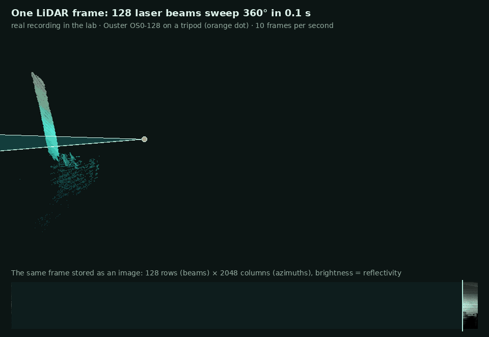
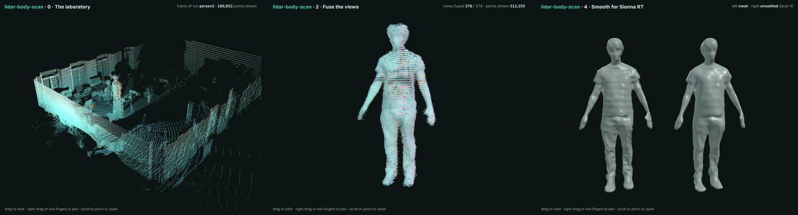
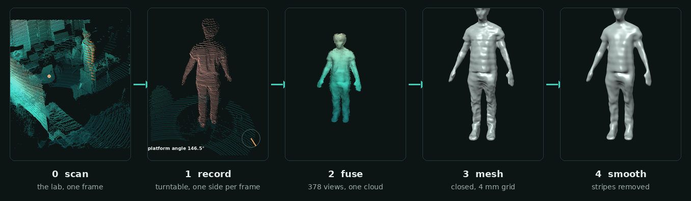
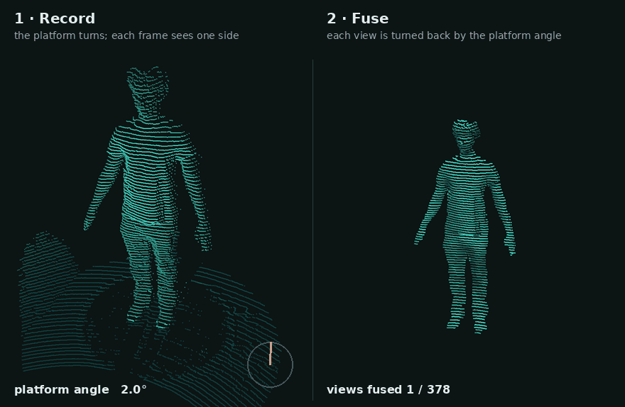
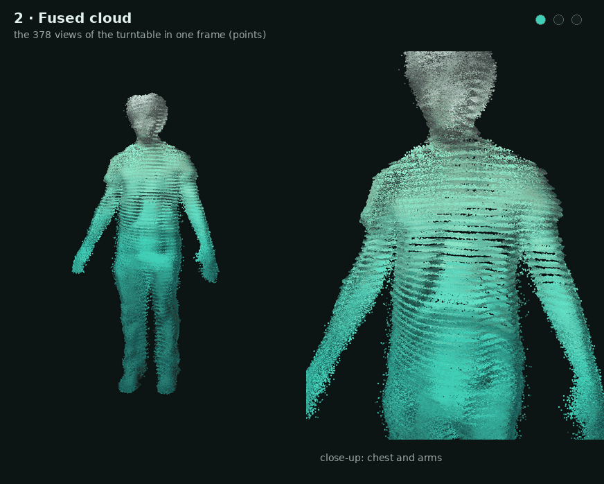
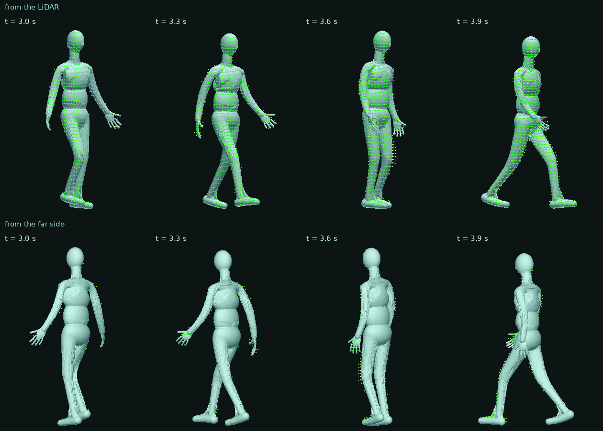

<div align="center">


<br>


**[Tour](#the-lab-through-the-lidar)** ·
**[Pipeline](#the-pipeline-step-by-step)** ·
**[Moving people](#moving-people)** ·
**[Features](#features)** ·
**[Gallery](#gallery)** ·
**[Install](#installation)** ·
**[Quick start](#quick-start-without-the-sensor)** ·
**[Usage](#usage)** ·
**[Architecture](#architecture)** ·
**[Docs](#documentation)**

</div>

---

## The lab through the LiDAR

An Ouster OS0-128 spins 128 laser beams ten times per second and returns, for every beam and every one of 2048 directions, a distance and a reflectivity. One frame is therefore both a 3D point cloud and a 128 x 2048 panoramic image. Below is one real frame of the laboratory where the data of this project are recorded.

<p align="center">
  
</p>

<p align="center"><sub>Real frame (run <code>person2</code>). Top: the 3D points, coloured by height and brightened by reflectivity, with the ceiling and the walls near the camera cut away; the orange dot is the sensor on its tripod. Bottom: the same frame as the sensor stores it, one row per beam and one column per azimuth. The person in amber is what differs from a recording of the empty room, which is also how the package finds people.</sub></p>

### Explore it in 3D

<p align="center">
  <a href="https://raw.githack.com/cocopops9/human-motion-3d-rf-sim/main/lidar-body-scan/docs/viewer/index.html"></a>
</p>

<p align="center"><b><a href="https://raw.githack.com/cocopops9/human-motion-3d-rf-sim/main/lidar-body-scan/docs/viewer/index.html">Open the interactive tour</a></b> · orbit the lab, play the turntable recording, fuse the 378 views one by one, and compare the raw and the smoothed mesh.<br><sub>A single self-contained page (<a href="docs/viewer/index.html"><code>docs/viewer/index.html</code></a>, about 9 MB, three.js). Locally: download it and open it in a browser (three.js is loaded from a CDN, so an internet connection is needed).</sub></p>

---

## The pipeline, step by step

The static body scan takes a person from a turntable to a mesh that Sionna RT can use, in four commands. Apart from the lab frame in the first tile, every picture in this section is real data from one scan, called `pepito` (run tt11).

<p align="center">
  
</p>

### 1 · Record: the person turns, the sensor stays

The person stands in an A-pose, palms forward, on a motorized platform about 1.6 m from the LiDAR. The platform turns at about 4 degrees per second, so one lap takes 90 s and gives 900 frames. Each frame sees only the side of the body that faces the sensor.

### 2 · Fuse: every view goes back to the same body frame

`fuse` finds the platform axis from the ring of the platform in the empty scene, estimates the platform angle for every frame, cuts the person out of the scene, turns every view back by its angle and fuses all of them into one cloud with normals and a per-point confidence.

<p align="center">
  
</p>

<p align="center"><sub>Left: raw frames of run tt11 as recorded, the person coloured by the platform angle (dial). Right: the views of the same run, each turned back by its angle, accumulating in the body frame with the same colours; at the end all 378 views (3.7 laps) coloured by height.</sub></p>

### 3 · Mesh and 4 · Smooth

`mesh` converts the cloud into a closed triangle mesh (Poisson reconstruction, a closed manifold remesh on a 4 mm grid, flat soles) and applies no smoothing. The stripes left on it are the scan rows of the LiDAR. `smooth` removes them while keeping the shape and the volume.

<p align="center">
  
</p>

<p align="center"><sub>The fused cloud, the mesh straight from the conversion, and the same triangles after <code>smooth</code> (level 4 of the ladder in the <a href="#gallery">gallery</a>). Flat shading with a small highlight, so every facet tilt is visible, as a mirror would show it.</sub></p>

<p align="center">
  
</p>

Why the last step matters: at 60 GHz the wavelength is 5 mm, and a surface looks smooth to the wave when its bumps stay under λ/8 = 0.62 mm. A raw scan has stripes a few millimetres tall, so triangle normals point in many directions and reflected rays scatter. The working assumption of this project is that Sionna RT reflects on the face normals, so the geometry itself has to be smooth (this assumption has not been checked against Sionna).

<p align="center">
  
</p>

<p align="center"><sub>The smoothed mesh of <code>pepito</code>. It is also in <a href="docs/models/person_pepito_smooth_preview.stl"><code>docs/models/person_pepito_smooth_preview.stl</code></a>: GitHub opens it in a 3D viewer you can rotate (60,000 triangles, decimated for the preview).</sub></p>

The commands of these four steps, with all their options, are in [Usage](#usage); how each step works is in [docs/algorithms.md](docs/algorithms.md).

---

## Moving people

Version 1.2 animates the person. The turntable scan gives the person's body (the SMPL-X body model fitted to the scan, with the scan's detail); then the person walks or jumps around the same LiDAR, and the body is fitted to every frame. The result is an **animated mesh**: one mesh per time step at any rate, the same triangles throughout, the velocity of every vertex, and the person's joints over time, ready for a micro-Doppler simulation in Sionna RT.

<p align="center">
  
</p>

<p align="center"><sub>Synthetic data: the procedural test body walking 2 m from a simulated OS0-128 (1024 x 20), tracked by <code>bodyscan track</code>. Green dots are the LiDAR points of each frame, on the tracked body. Top: seen from the LiDAR. Bottom: the same instants from the far side, where the sensor saw almost nothing; that side follows from the body model and the motion rules, not from data.</sub></p>

The motion comes only from the LiDAR. Where one sensor cannot see (the arm on the far side), joint limits, the floor, feet that do not slide and smooth accelerations keep the body plausible, and every frame records which body parts were actually observed. The whole guide, with the recording protocol and the limits: **[docs/motion.md](docs/motion.md)**.

---

## Features

| | |
|---|---|
| **Capture** | Records a standing person on a motorized turntable, or turning in place by small steps. The motor can be driven from this PC (serial) or from another PC with the included MATLAB script. A short empty-scene recording and a countdown are part of the sequence. |
| **View check** | `check-view` tells you, before recording, whether head and feet are inside the vertical field of view, the best sensor tilt, and the smallest gap the sensor can see at the person. |
| **Fusion** | Finds the platform centre from its ring, estimates the platform angle for every frame, and fuses the views into one cloud with normals and a per-point confidence. |
| **Mesh** | Poisson reconstruction, a closed manifold remesh on a 4 mm grid, flat soles, and a quality report: facet normal noise, bump height against λ/8 and λ/32, distance to the cloud. No smoothing is applied here. |
| **Smooth** | Normal filtering, then vertex update, then volume restoration, repeated for the rounds you choose. Every parameter is direct: scale, rounds, finishing rounds, normal sigma, deviation limit. `--sweep` writes one mesh per value to compare. |
| **Detect** | Finds objects rotating about a vertical axis and objects shaped like a standing person in any recording, and gives their centres. |
| **Moving people** | `capture-motion`, `segment-motion`, `avatar`, `track`, `review-motion`, `export-motion`: from a recording of a person walking or jumping to an animated mesh with per-vertex velocities, through a body model fitted to the person's turntable scan and to every frame. |
| **Synthetic bench** | `simulate-motion` scans a moving body with a simulated OS0-128 (rolling shutter, beam footprint, dropouts) with the exact truth; `evaluate-motion` and `bench-motion` measure joint, velocity and Doppler errors. |
| **Reproducible** | Every run writes a JSON report with the complete configuration. Settings come from options, TOML/JSON files, or `--set section.name=value`. |
| **Light install** | Only numpy and open3d for the processing. scipy is not used. Works with the Python that MATLAB uses, for PCs where software can only be installed through MATLAB. |
| **Tested** | Unit and end-to-end tests on synthetic recordings, and a `simulate` command that makes them without the sensor. |

---

## Gallery

### What smoothing does to the surface

<p align="center">
  
</p>

The scan rows leave horizontal stripes. In the middle panel every stripe tilts the triangles up or down, and a ray bouncing there would be deflected by twice the tilt. In the right panel the stripes are gone and the body shape is kept.

Measured on the whole `pepito` body (383,764 triangles). The smoothing is level 4 of the ten-step ladder below: `--scale-mm 12 --rounds 2`, plus the 2 default finishing rounds at 6 mm.

| | before `smooth` | after `smooth` |
|---|---|---|
| facet normal noise, median | 1.28° | 0.71° |
| facet normal noise, 90th percentile | 3.77° | 1.93° |
| facet normal noise, 99th percentile | 18.33° | 4.98° |
| bump height, rms | 0.147 mm | 0.031 mm |
| distance moved from the input | none | median 0.57 mm, 99th percentile 3.60 mm, max 6.96 mm |
| volume | 94.79 l | 94.79 l (kept) |

### Choosing the strength

`smooth` has no fixed levels: you set the parameters. The ladder below is ten settings of the same scan, from the lightest (level 1) to the strongest (level 10); five of them are drawn here. Level 8 has the lowest 90th percentile of the ten (1.46°). Level 10 is stronger but worse: 1 % of its facets are tilted by more than 91° and some vertices move 26 mm.

<p align="center">
  
</p>

| Level | scale | rounds | finishing | facet noise p90 | facet noise p99 | largest move |
|---|---|---|---|---|---|---|
| input | none | none | none | 3.77° | 18.33° | 0 mm |
| 1 | 6 mm | 1 | none | 2.86° | 6.68° | 3.1 mm |
| 4 | 12 mm | 2 | 2 at 6 mm | 1.93° | 4.98° | 7.0 mm |
| 6 | 12 mm | 8 | 2 at 6 mm | 1.54° | 6.28° | 12.1 mm |
| 10 | 24 mm | 8 | 2 at 6 mm | 1.92° | 90.82° | 26.2 mm |

Read the 99th percentile and the largest move together with the median, not only the median. [docs/tuning.md](docs/tuning.md) explains every parameter, organised by symptom.

### The files you get

Every command writes plain `.ply` files that open in MeshLab, CloudCompare or Blender. To look at one from Python:

```
python -c "import open3d as o3d; o3d.visualization.draw_geometries([o3d.io.read_triangle_mesh(r'C:\lidar\person_tt17_smooth.ply')])"
```

| File | What it is | How it looks |
|---|---|---|
| `person_tt17_views.ply` | every view in its own colour | the raw material, one colour per sensor view |
| `person_tt17.ply` | the fused point cloud with normals, z = 0 at the platform top | the left picture above |
| `person_tt17_confidence.ply` | the same cloud with, per point, the number of views, points and spread | where the cloud can be trusted |
| `person_tt17_mesh.ply` | the closed mesh, no smoothing | the middle picture above |
| `person_tt17_smooth.ply` | the smoothed mesh | the right picture above, the file for Sionna RT |
| `*_quality.json` | facet noise, bump height, distance moved | the numbers in the table above |

---

## Installation

Only numpy and open3d are needed for the processing; matplotlib (plots) is optional; ouster-sdk is needed only to record (and pyserial only when this PC drives the motor). scipy is not used. The commands for moving people also need PyTorch (`python -m pip install torch`; the CUDA build on a PC with an NVIDIA GPU), Pillow for the review GIF, and the SMPL-X model files (register at https://smpl-x.is.tue.mpg.de; the licence does not allow putting them in the repository).

On a PC where new software can only be installed through MATLAB, use the Python that MATLAB uses (`pyenv` in MATLAB shows it) and install the packages for it from MATLAB's Add-On Explorer or with that interpreter. Nothing has to be installed for the package itself: clone the repository and run the commands from its folder.

This package lives in the `lidar-body-scan/` folder of the `human-motion-3d-rf-sim` repository:

```
git clone https://github.com/cocopops9/human-motion-3d-rf-sim.git
cd human-motion-3d-rf-sim/lidar-body-scan
python -m bodyscan --help
```

Three equivalent ways to run a command:

- command prompt in the repository folder: `python -m bodyscan fuse C:\lidar\tt17`
- from any folder: `C:\path\to\lidar-body-scan\bodyscan.bat fuse C:\lidar\tt17` (set `BODYSCAN_PYTHON` to MATLAB's python.exe if it is not on PATH)
- from MATLAB, with the Python configured in `pyenv`: `addpath('C:\path\to\lidar-body-scan\matlab'); bodyscan('fuse', 'C:\lidar\tt17')`

Python 3.9 or later (tested with 3.11). Configuration files in TOML need Python 3.11 or later (JSON files with the same structure work with any version).

## Quick start without the sensor

Everything below runs on synthetic data, with no sensor and no motor:

```
python -m bodyscan simulate detect C:\lidar\sim_detect
python -m bodyscan detect C:\lidar\sim_detect --rotation --human
python -m bodyscan simulate turntable C:\lidar\sim_tt
python -m bodyscan fuse C:\lidar\sim_tt --out C:\lidar\sim_person --ignore-phases
python -m bodyscan mesh C:\lidar\sim_person.ply --out C:\lidar\sim_person_mesh.ply
python -m bodyscan smooth C:\lidar\sim_person_mesh.ply --out C:\lidar\sim_person_smooth.ply
```

---

## Usage

### Workflow on the turntable

<details open>
<summary><b>1. Check the view</b> after moving or tilting the sensor</summary>

<br>

Person on the platform, 20 s. Every part of the body must be inside the vertical field of view.

```
python -m bodyscan capture-turntable C:\lidar\check1 --duration 20
python -m bodyscan check-view C:\lidar\check1 --person-height 1.95
```

It prints the sensor height and tilt, the platform distance, the heights the highest and lowest beams reach at the person, the tilt that fits head and feet, and the sample spacing and smallest visible gap at the person.

</details>

<details open>
<summary><b>2. Record</b></summary>

<br>

With the motor on this PC (close MATLAB first, it holds the port):

```
python -m bodyscan capture-turntable C:\lidar\tt17 --motor-port COM3 --turn-deg 1800
```

With the platform driven by `girogirotondo_timer.m` on the other PC: start the MATLAB script first, then within about 30 s

```
python -m bodyscan capture-turntable C:\lidar\tt17 --turn-deg 1800
```

The recording starts with 3 s of empty scene (stay away from the platform), then 15 s of countdown (step onto the centre, A-pose, palms forward), then the turn. The length of a two-PC recording is computed from `--turn-deg` and the platform timing; without `--turn-deg` it records until ENTER is pressed.

</details>

<details open>
<summary><b>3. Fuse</b> the views into one cloud</summary>

<br>

```
python -m bodyscan fuse C:\lidar\tt17 --out C:\lidar\person_tt17
```

Outputs: `person_tt17.ply` (cloud with normals, z = 0 at the platform top, origin on the platform axis), `person_tt17_confidence.ply` (per point: views, points and spread of the surface), `person_tt17_views.ply` (every view in its own colour), `person_tt17.json` (everything measured, and the full configuration), `person_tt17_angle.png` (platform angle against time). The platform centre is found from its ring in the empty scene, searched around the person; `--center X Y` imposes it.

</details>

<details open>
<summary><b>4. Mesh</b>: conversion of the cloud into a closed mesh, without smoothing</summary>

<br>

```
python -m bodyscan mesh C:\lidar\person_tt17.ply --out C:\lidar\person_tt17_mesh.ply
```

Poisson reconstruction, a closed manifold remesh on a 4 mm grid, flat soles at the platform top, and a quality report (`person_tt17_mesh_quality.json`): facet normal noise, angles between neighbouring triangles, bump height against λ/8 and λ/32 (60 GHz by default, `--frequency-ghz`), distance to the fused cloud.

</details>

<details open>
<summary><b>5. Smooth</b> for Sionna RT</summary>

<br>

`smooth` takes any closed mesh and smooths it with the parameters you give it directly. `--scale-mm` is the size of what is removed (12 mm by default: the scan-row stripes) and `--rounds` the strength (4). Two finishing rounds at 6 mm clean what is left. The volume is kept, and the distance of every vertex from the input is reported; `--max-deviation-mm` bounds it if you want a guarantee. `--sweep` writes one mesh per value, to compare:

```
python -m bodyscan smooth C:\lidar\person_tt17_mesh.ply --out C:\lidar\person_tt17_smooth.ply
python -m bodyscan smooth C:\lidar\person_tt17_mesh.ply --out C:\lidar\person_tt17_smooth.ply --rounds 8
python -m bodyscan smooth C:\lidar\person_tt17_mesh.ply --out C:\lidar\tt17_s.ply --sweep rounds=1,2,4,8
```

[docs/tuning.md](docs/tuning.md) shows what each parameter does, measured on tt11 and tt16.

</details>

### Workflow in place (no turntable)

```
python -m bodyscan capture-inplace C:\lidar\person1 --duration 140 --cue-every 4
python -m bodyscan fuse-inplace C:\lidar\person1 --out C:\lidar\person1_fused
python -m bodyscan mesh C:\lidar\person1_fused.ply --out C:\lidar\person1_mesh.ply
python -m bodyscan smooth C:\lidar\person1_mesh.ply --out C:\lidar\person1_smooth.ply
```

At every beep the person turns by a small step (20 to 30 degrees) and holds still. The person is found in the frames automatically (`--center X Y` or `--crop-min/--crop-max` impose the region).

### Workflow for moving people

```
python -m bodyscan avatar C:\lidar\person_tt17.ply --model C:\smplx\SMPLX_NEUTRAL.npz --out C:\lidar\s01_avatar
python -m bodyscan capture-motion C:\lidar\s01_walk01 --duration 60
python -m bodyscan segment-motion C:\lidar\s01_walk01 --out C:\lidar\s01_walk01_seg
python -m bodyscan track C:\lidar\s01_walk01_seg --avatar C:\lidar\s01_avatar.npz --out C:\lidar\s01_walk01_motion
python -m bodyscan review-motion C:\lidar\s01_walk01_motion.npz --segments C:\lidar\s01_walk01_seg --avatar C:\lidar\s01_avatar.npz --out C:\lidar\s01_walk01_review
python -m bodyscan export-motion C:\lidar\s01_walk01_motion.npz --avatar C:\lidar\s01_avatar.npz --out C:\lidar\s01_walk01_meshes --rate 200
```

The take starts with 10 s of empty room, then the person stands 3 s in the A-pose on a floor mark, moves, and ends with 3 s in the A-pose. Use the sensor in 1024 x 20 mode. Without the sensor or the SMPL-X files, the whole chain runs on synthetic data:

```
python -m bodyscan make-test-body C:\lidar\testbody.npz
python -m bodyscan simulate-motion C:\lidar\sim_walk --model C:\lidar\testbody.npz --motion walk --distance 2.5
python -m bodyscan avatar C:\lidar\sim_walk\scan.ply --model C:\lidar\testbody.npz --out C:\lidar\sim_avatar
python -m bodyscan segment-motion C:\lidar\sim_walk --out C:\lidar\sim_walk_seg
python -m bodyscan track C:\lidar\sim_walk_seg --avatar C:\lidar\sim_avatar.npz --out C:\lidar\sim_walk_motion
python -m bodyscan evaluate-motion C:\lidar\sim_walk_motion.npz --truth C:\lidar\sim_walk --avatar C:\lidar\sim_avatar.npz
```

### Detection

```
python -m bodyscan detect C:\lidar\tt17 --rotation            objects turning about a vertical axis
python -m bodyscan detect C:\lidar\tt17 --human               objects shaped like a standing person
python -m bodyscan detect C:\lidar\tt17 --rotation --human    rotating people
```

Input: a capture directory, or a folder of point clouds (one `.ply`, `.pcd`, `.xyz` or `.npz` per frame, in the sensor frame). Output: a table on the console, `<out>.json`, and a top view `<out>_top.png`. The centre of a rotating object is its rotation axis (a few mm); the centre of a person who does not rotate is estimated from the visible surface (a few cm). Recordings with empty-scene frames are segmented against the empty scene; others are cut into objects after removing the walls, and the furniture is left to the tests.

### Other tools

| Command | Purpose |
|---|---|
| `check-sensor` | network diagnosis when no frames arrive (UDP ports, destination, firewall) |
| `convert` | an Ouster recording (`.osf`, or `.pcap` with `--meta`) to a capture directory |
| `quality` | the quality report of any mesh |
| `params` | the parameter reference (`docs/parameters.md`) |
| `simulate` | synthetic recordings (turntable, in place, detection scene) |
| `simulate-motion` | a synthetic recording of a moving body, with its truth |
| `evaluate-motion` | the errors of a tracked motion against that truth |
| `bench-motion` | simulate, track and evaluate over motions, sensor modes and distances |
| `make-test-body` | a procedural body in the SMPL-X file format, for tests without SMPL-X |

### Configuration

Every parameter is an option of its command (`python -m bodyscan fuse --help`), a key of a configuration file, and a `--set section.name=value` override. Precedence: defaults, then `--config` files in order, then options, then `--set`. `--write-config FILE` writes the effective configuration and stops, as a starting point:

```
python -m bodyscan fuse C:\lidar\tt17 --write-config my_turntable.toml
python -m bodyscan fuse C:\lidar\tt17 --config my_turntable.toml --out person_tt17
```

`configs/` holds the full defaults of every command (`*_default.toml`) and some variants:

| File | Use |
|---|---|
| `mesh_detail_2mm.toml` | gaps down to about 3 mm, 4 times the triangles |
| `mesh_budget_140k.toml` | fewer triangles |
| `mesh_generic.toml` | any object, surface left open |
| `smooth_previous_mesh.toml` | the smoothing that `mesh` applied by itself up to version 1.0, to reproduce older meshes |
| `track_default.toml` and the other motion `*_default.toml` | the defaults of the commands for moving people |
| `turntable_fingers.toml` | experimental: fusion that keeps narrower gaps |

The JSON report of every run contains its complete configuration, so a result can always be reproduced.

### Tests

```
python -m unittest discover -s tests -t .                         about 2 minutes
set BODYSCAN_SLOW_TESTS=1 && python -m unittest discover -s tests -t .   with the fusion, avatar and tracking runs
```

The tests of moving people need PyTorch and are skipped without it.

---

## Architecture

The package is organised in layers; a layer uses only the layers above it in this list, so a new setup (another sensor, no turntable, another body model) reuses everything except the part that changes.

```
bodyscan/
    config.py        parameter declarations: options, files, documentation
    geometry/        transforms, fitting (planes, circles), neighbours, clustering
    io/              recordings on disk, sensor models, PLY writers
    scene/           floor, background, platform, regions, isolation, stillness, coverage
    registration/    ICP variants, turn solver, keyframe registration
    motion/          platform angle against time: models, fitting, pairs, estimator
    fusion/          views, per-view corrections, surface fusion
    meshing/         reconstruction, cleanup, watertight remesh, smoothing, quality
    detection/       segmentation, tracking, rotation test, person cascade
    capture/         sensor access, run directory, phases, protocols, motor
    pipelines/       the steps assembled for one setup
    body/            body model in the SMPL-X format: skeleton, rotations, skinning, test body
    dynamic/         moving people: simulation, segmentation, avatar, tracking, evaluation, export
    commands/        the command line
```

A pipeline is a list of steps that read and write named entries of a shared context; the turntable pipeline is `LoadTurntableRecording`, `SceneFromBackground`, `LocatePlatform`, `IsolatePerson`, `MeasureAngles`, `SelectViews`, `BuildViews`, `CorrectViews`, `FuseSurface`, `WriteOutputs`. Every parameter is declared once, as a dataclass field, and from that declaration come the command-line option, the TOML key, the `--set` override and the parameter reference. Only `capture` imports the Ouster SDK and only `body` and `dynamic` import PyTorch, so the static processing needs numpy and open3d only. Details and how to add a step or a command: [docs/architecture.md](docs/architecture.md).

## Documentation

| Document | Read it for |
|---|---|
| [docs/motion.md](docs/motion.md) | moving people: workflow, recording protocol, how the tracking works, accuracy, limits, Sionna RT |
| [docs/hardware.md](docs/hardware.md) | what the OS0-128 can resolve (fingers), and where to put the sensor for a person up to 2 m |
| [docs/tuning.md](docs/tuning.md) | how each tunable parameter changes the results, organised by symptom |
| [docs/parameters.md](docs/parameters.md) | every parameter of every command (generated from the code) |
| [docs/algorithms.md](docs/algorithms.md) | how the processing works, step by step |
| [docs/architecture.md](docs/architecture.md) | how the code is organised and how to extend it |
| [CHANGELOG.md](CHANGELOG.md) | the history of the versions |

## Repository layout

| Folder | What |
|---|---|
| `bodyscan/` | the Python package (run as `python -m bodyscan COMMAND`) |
| `configs/` | configuration files: full defaults of every command, and variants |
| `docs/` | technical documentation, the pictures and animations of this page (`docs/img`), the interactive tour (`docs/viewer`) and a 3D preview (`docs/models`) |
| `matlab/` | `bodyscan.m` (runs a command with MATLAB's Python), `girogirotondo_timer.m` (platform from the other PC) |
| `tests/` | unit and end-to-end tests on synthetic data |
| `legacy/` | the single-file scripts this package replaces, kept to reproduce earlier results |

## Results so far

| Run | Result |
|---|---|
| synthetic turntable (one lap) | axis within 0.5 mm, angles 1.3 deg rms, fused cloud to truth median 2.2 mm |
| synthetic in place (16 stops) | turns within 2.9 deg, fused cloud to truth median 1.6 mm |
| tt16 mesh (conversion only) | closed, facet noise median 3.6 deg (p90 13.1), bump height rms 0.48 mm < λ/8 = 0.62 mm at 60 GHz |
| tt16 mesh, then `smooth` (defaults) | facet noise median 0.6 deg (p90 2.0), bump height rms 0.31 mm, surface moved by 1.0 mm median (p99 5.4 mm) |
| tt11 (pepito) mesh, then `smooth` level 4 | facet noise median 0.71 deg (p90 1.93), bump height rms 0.031 mm, volume kept, surface moved by 0.57 mm median (p99 3.6 mm) |
| detection on tt13, tt14, tt15 | the person only (furniture, boxes and stands rejected) |
| moving person, synthetic walk at 2 m, 1024 x 20 (test body, avatar fitted to a simulated scan) | joints 13 mm mean (observed parts 9 mm, the far arm 42 mm), body-part velocities 0.11 m/s rms (43 Hz at 60 GHz), standing feet 6 mm/s |
| moving person, synthetic jumps at 2 m, 1024 x 20 | joints 12 mm mean, body-part velocities 0.14 m/s rms (57 Hz at 60 GHz) |
| the same jumps at 2048 x 10 | joints 36 mm, velocities 0.62 m/s: record moving people at 1024 x 20 ([docs/motion.md](docs/motion.md), section 6) |

<br>

<p align="center"><sub>The pictures were rendered from real recordings (the lab frame of run <code>person2</code>, the <code>pepito</code> scan of run tt11) with a plain point splatter and ray caster (no textures, flat shading), so the meshes show the geometry a ray tracer sees.</sub></p>
