# How the processing works

This document follows the data from the sensor to the mesh, in the order the
commands run: `check-view`, `detect` (the finder every command uses), `fuse`
or `fuse-inplace`, `mesh`, `smooth`. The Algorithm Lab has the same order,
one chapter per step (table below). Every section names the module that
implements it; the parameters are in
[parameters.md](parameters.md), their effect in [tuning.md](tuning.md).

> **Interactive companion: the [Algorithm Lab](https://raw.githack.com/cocopops9/human-motion-3d-rf-sim/main/lidar-body-scan/docs/lab/index.html).** Every step below
> runs there as a live simulation on 2D slices of a real scan (run tt9, the
> scan `pepito`), with the package's rules and default parameters: move a
> slider and watch the field of view, the background subtraction, the
> rotation test and the person cascade, the registration about the axis, the motor-model fit, the fusion, the Poisson surface, the
> watertight remesh and the smoothing respond. The animations in this
> document are recorded from it. 2D slices show the mechanisms; the measured
> 3D results are in [tuning.md](tuning.md).

| Step | Command | Section | Lab chapter |
|---|---|---|---|
| place the sensor: head and feet in view, sampling | `check-view` | [2](#2-placing-the-sensor-bodyscan-check-view-scenecoverage) | [1 · field of view, smallest visible gap](https://raw.githack.com/cocopops9/human-motion-3d-rf-sim/main/lidar-body-scan/docs/lab/index.html#sensor) |
| find the object, no region assumed (foreground, tracks, tests) | `detect`, and every command | [3](#3-finding-the-object-of-interest-detection-pipelinesdetect) | [2 · foreground threshold, rotation test, person cascade step by step](https://raw.githack.com/cocopops9/human-motion-3d-rf-sim/main/lidar-body-scan/docs/lab/index.html#finding) |
| isolate it in every frame | `fuse`, `fuse-inplace` | [4](#4-isolating-the-person-scenebackground-sceneisolation) | [3 · the chain of tests on a real frame](https://raw.githack.com/cocopops9/human-motion-3d-rf-sim/main/lidar-body-scan/docs/lab/index.html#isolation) |
| platform angle of every frame | `fuse` | [5.3](#53-platform-angle-of-every-frame-motion) | [4 · frames → angles → fused cloud, ICP, axis error, motor model](https://raw.githack.com/cocopops9/human-motion-3d-rf-sim/main/lidar-body-scan/docs/lab/index.html#angles) |
| views turned back and fused | `fuse` | [5.4](#54-views-fusionviews), [5.6](#56-fusion-fusionsurface) | [5 · turn back, support filter, voxels, surface fit](https://raw.githack.com/cocopops9/human-motion-3d-rf-sim/main/lidar-body-scan/docs/lab/index.html#fusion) |
| points to surface | `mesh` | [7](#7-meshing-pipelinesmesh-pipelinessmooth-meshing), step 1 | [6 · Poisson and marching squares](https://raw.githack.com/cocopops9/human-motion-3d-rf-sim/main/lidar-body-scan/docs/lab/index.html#poisson) |
| closed mesh | `mesh` | [7](#7-meshing-pipelinesmesh-pipelinessmooth-meshing), step 3 | [7 · signed distance, ray parity, step by step](https://raw.githack.com/cocopops9/human-motion-3d-rf-sim/main/lidar-body-scan/docs/lab/index.html#watertight) |
| smoothing | `smooth` | [7](#7-meshing-pipelinesmesh-pipelinessmooth-meshing), step 4 | [8 · one round, reflection lines in 3D, reflected rays](https://raw.githack.com/cocopops9/human-motion-3d-rf-sim/main/lidar-body-scan/docs/lab/index.html#smoothing) |

## 1. Data and coordinate frames

**Recording** (`bodyscan.io.recording`). A capture directory holds `lut.npz`
(per-pixel unit direction and offset: xyz = range x direction + offset, exact
for Ouster sensors, so the processing needs no SDK), `background/` (frames of
the empty scene), `frames/` (range image in mm, sensor time of every column,
host time, phase label, fraction of columns received) and `capture.json`.
`NpzRecording` reads it; `PointCloudFolder` reads one point cloud per frame;
both are `FrameSource`s.

**Frames of reference.**

| Frame | Definition |
|---|---|
| sensor | the sensor's own axes (Ouster convention) |
| floor | z along the floor normal, z = 0 on the floor, origin on the floor below the sensor, x along the projection of the sensor x axis |
| output (turntable) | floor frame shifted so that the origin is on the platform axis at the platform top (z = 0 where the feet stand) |
| output (in place) | floor frame shifted so that the origin is on the floor below the centre of the body |

**Floor** (`scene.floor.RansacFloor`). Planes are found one after the other by
RANSAC on a subsample of the empty scene; the floor is the plane with the most
points among those below the sensor whose normal is within `max_tilt_deg` of
the up direction (walls and the ceiling are excluded), refitted by least
squares to the points within `refit_band`. The sensor height and tilt are
reported.

## 2. Placing the sensor (`bodyscan check-view`, `scene.coverage`)

Nothing in the processing restores what the beams never reached, so the first
step happens before the scan: `check-view` on a 20 s capture with the person
on the platform, after every change of the sensor position. It finds the
floor, the platform centre and the person (section 3), then reports:

1. **Field of view**: the elevation of the highest and of the lowest beam
   pointing towards the platform (the OS0-128 spans about 90° in 128 beams,
   tilted by the tripod), against the elevations needed for the top of the
   head and for the platform top at the front of the feet:
   atan((stature − h) / (d − 0.10)) and −atan((h − 0.03) / (d − 0.15)), with
   h the sensor height and d its horizontal distance from the axis. With a
   margin (`--margin`, 3°) on both sides: OK, or the tilt that centres the
   fan (any value in the printed range works), or "move the sensor back or
   raise it" when no tilt holds both.
2. **Sampling**: on a surface facing the sensor at distance d, columns are
   d · 0.176° apart (2048 per turn), beams d · 0.71° apart, and a beam has a
   footprint of 5 mm + d · 0.35°. A gap between two surfaces is resolved when
   it is wider than the footprint plus two sample steps across it
   (`Sampling.smallest_gap`): at 1 m, 17 mm across the columns and 36 mm along
   the height. [hardware.md](hardware.md) derives these numbers and what
   they mean for fingers.

  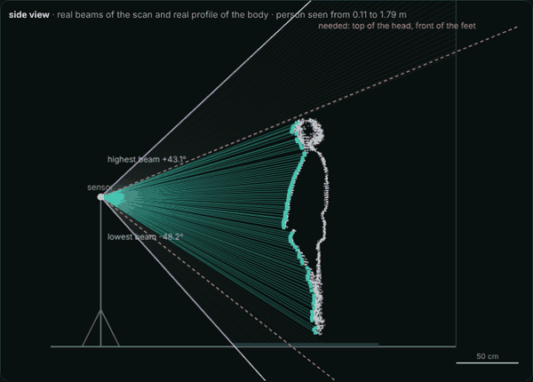
  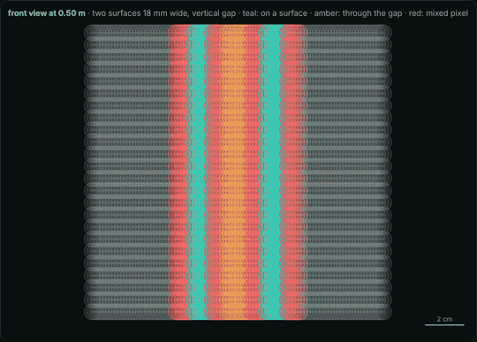

Left: the real fan of beams of the scan (sensor 1.20 m high, 1.64 m from the axis) on the real side profile of the fused body, as the tilt changes and then as the sensor comes closer: the beams that end on the body (teal), the beams needed for head and feet (amber) and the limits of the fan (violet). Right: beams on two surfaces 20 mm apart (teal: on a surface, amber: through the gap, red: mixed pixel) as the sensor moves away, for a vertical and then a horizontal gap. <b><a href="https://raw.githack.com/cocopops9/human-motion-3d-rf-sim/main/lidar-body-scan/docs/lab/index.html#sensor">▶ try it live</a></b>

## 3. Finding the object of interest (`detection`, `pipelines.detect`)

One mechanism finds the object of interest in every command, without a
region of the room: `detection.finder.ObjectFinder` (foreground, objects,
tracks) and a chain of `detection.selectors` (tests). `bodyscan detect` lists
every object with the verdicts; `fuse` and `fuse-inplace` take the selected
object with the most points over the frames and measure their region on it.

| flag | selector | test | default in |
|---|---|---|---|
| `--near X Y` | `NearSelector` | centre within `near_radius` of a point | (none) |
| `--human` | `HumanSelector` | the Haar-like person cascade (step 6 below) | `fuse-inplace` |
| `--rotation` | `RotationSelector` | turning about a vertical axis (step 5), optionally by `min_total_turn` | `fuse` (320°) |

The chain is an AND, evaluated cheapest first, and stops at the first
failure, so an object that is not a person is never registered for the
rotation test. A new criterion (a size range, a colour from reflectivity, a
learned classifier) is a `Selector` subclass added to the chain; nothing
else changes. Without any flag, `detect` runs both tests on every object for
the report, and the fusion commands take the object with the most points.

1. **Frames**: `max_frames` frames spread over the recording (the rotation test
   needs frames several degrees of turn apart).
2. **Scene**: the floor from the empty scene, or from the per-pixel median of
   the frames (what most frames agree on).
3. **Segmentation** (`detection.segmentation`): with empty-scene frames, the
   foreground against them; without, every point between `min_height` and
   `max_height` minus the large vertical planes (walls) of the static scene.
   Points thinned to 2 cm voxels and clustered (DBSCAN, `cluster_distance`).
4. **Tracking** (`detection.tracking`): greedy nearest-centroid association
   between frames (`track_distance`).
5. **Rotation test** (`detection.rotation`): a cheap test first: an object
   unchanged between its first, middle and last frames is static. Otherwise
   pairs of observations are registered with 4 degrees of freedom
   (p' = R p + t); a turn θ about a vertical axis through c gives
   t = (I - R) c, so c = (I - R)⁻¹ t. A rotating object gives the same axis and
   the same angular speed for every pair (`max_axis_spread`,
   `max_speed_spread`, `min_sign_agreement`); a walking person gives axes all
   over the place; a symmetric object gives random turns. Pairs slower than
   `min_speed` or turning less than `still_turn` are **still pairs** (a
   turntable waits before it starts and after it stops): they are counted
   but kept out of the speed, sign and axis statistics. The turn covered by
   the track (neighbouring turns summed from the first turning one to the
   last) can be required to reach `min_total_turn` (a whole lap). The axis is
   refined by the joint fit of the turntable pipeline. Rotating objects with
   the same axis and speed are parts of one body (an arm split from the
   torso). On tt9 (frames 0 to 1110, the first 18 s still), 37 frames give
   the axis 4 mm from the fusion's and a turn of 366° (truth about 370°).
6. **Person cascade** (`detection.human`), in the spirit of a Haar cascade
   (Viola and Jones 2001): cheap tests first, each one can reject.

   | Stage | Test | Rejects |
   |---|---|---|
   | size | top 1.2 to 2.3 m, bottom below 0.5 m, width 0.12 to 2.0 m, 80 points | small objects, ceiling lamps, shelves |
   | column | points at every height slice from bottom to top | tables, objects hanging in the air |
   | silhouette | area of the silhouette seen from the sensor ≥ 0.20 m², solid torso ≥ 0.18 m wide | poles, stands, tripods |
   | surface | fewer than 65 % of the normals along 3 dominant directions | flat panels, doors, cut-outs |
   | shape (scored) | weighted mean of the features below ≥ 0.6 | furniture, coat racks |

   The silhouette is an occupancy image (lateral position across the line of
   sight against height) whose cells grow with the distance like the beam
   spacing; rectangles are in units of the object's height, and their
   occupancy comes from four look-ups in the integral image. Features: head
   isolated on top (the head box filled, its flanks empty; double weight),
   shoulders wider than the head, compact legs, upper body at least as wide as
   the legs, head above the torso, curved surface (few normals along the
   dominant directions: people 0.2 to 0.35, boxes and chairs 0.5 to 0.8). A
   tracked object is a person when at least half of its frames (and two)
   pass.

  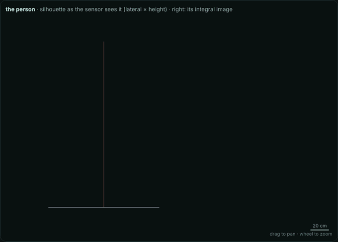

The cascade on a real object of frame 300, stage by stage: size, 5 cm height slices, the occupancy image filled row by row, the integral image I(r, c), then each Haar-like feature with the four look-ups I(D) − I(B) − I(C) + I(A) of its rectangles and its score, and the weighted mean against <code>score_threshold</code>. The person scores 0.95; an object 1.80 m tall passes the hard stages but scores 0.41 (no isolated head, no compact legs). <b><a href="https://raw.githack.com/cocopops9/human-motion-3d-rf-sim/main/lidar-body-scan/docs/lab/index.html#detection">▶ try it live</a></b>

7. **Centres and reach**: the rotation axis for a rotating object; for a
   person that does not rotate, the centroid of the visible surface moved
   away from the sensor by `body_radius` (10 cm); else the median of its
   points. The reach (99.5 % of the horizontal distances of its points from
   the centre, over all frames) sizes the region of the fusion pipelines.

  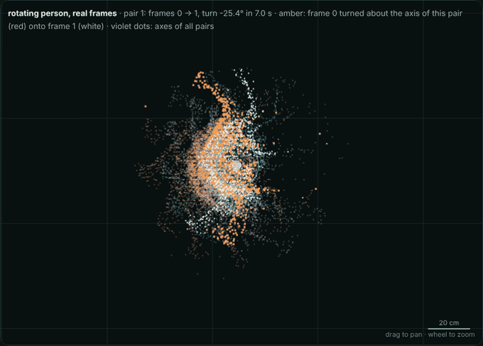
  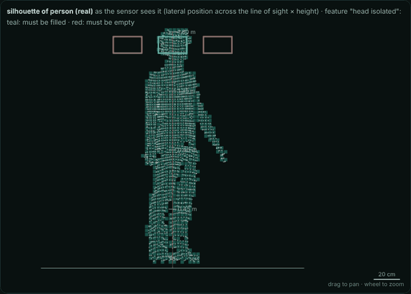

Left: the rotation test on real frames of the person on the platform (tt9): each pair's turn and shift give an axis c = (I − R)⁻¹ t; the 28 axes agree within 9 mm and the median lies 4 mm from the axis of the fusion. A synthetic walking track gives axes 0.56 m apart and is rejected. Right: the silhouettes (occupancy images) of the person and of real objects of the lab with the rectangles of a Haar-like feature; the person passes with a shape score of 0.95, every object is rejected by one of the stages. <b><a href="https://raw.githack.com/cocopops9/human-motion-3d-rf-sim/main/lidar-body-scan/docs/lab/index.html#detection">▶ try it live</a></b>

Measured on the lab subsets tt13, tt14 and tt15 (objects mode, no empty
scene): the person was the only object selected, out of 42 to 46 tracked
objects; on the chair turntable views no person was found and the chair's
axis was found; on views of a real body mesh ray-cast from 1 to 6.5 m and
every side, 71 of 72 views passed.

## 4. Isolating the person (`scene.background`, `scene.isolation`)

1. **Background**: per-pixel median range of the empty-scene frames (a pixel
   valid in fewer than half of them has no background).
2. **Foreground**: a pixel is foreground if it is closer than the background
   by more than max(`bg_threshold`, `bg_relative` x range), or if it has a
   return where the empty scene had none.
3. **Region**: measured on the object found by the finder (section 3), not a
   fixed place in the room: a vertical cylinder about its centre (the rotation
   axis on the turntable, the body centre in place) whose radius is the reach
   of its points over the run (99.5 % of their horizontal distances, arms
   included) plus `margin` (15 cm), between `min_height` and `max_height`.
   `radius` imposes a radius; `fuse-inplace` also accepts a crop box in the
   sensor frame.
4. **Mixed pixels**: a beam that hits an edge returns a range between the
   foreground and the background. A pixel whose range jumps by more than
   `edge_jump` towards both neighbours (horizontally or vertically) is dropped.
5. **Largest cluster** (DBSCAN, `cluster_eps`), statistical outliers removed,
   normals estimated (`normal_radius`) and turned towards the sensor.

  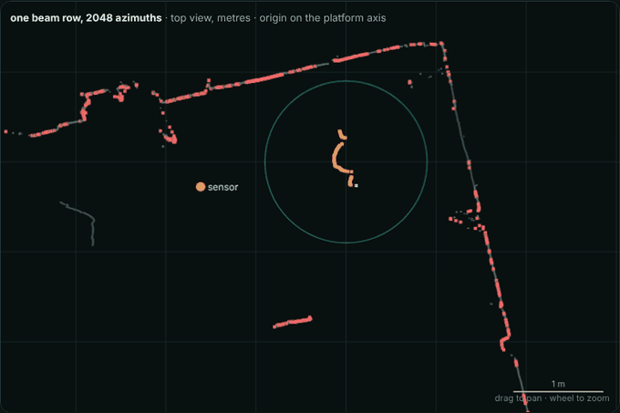

One real beam row of the sensor (2048 azimuths, top view) with the person on the platform. As <code>bg_threshold</code> drops to 0, range noise alone turns beams all over the room into false alarms (red); at the default 5 cm only the person (amber) is left inside the region. <b><a href="https://raw.githack.com/cocopops9/human-motion-3d-rf-sim/main/lidar-body-scan/docs/lab/index.html#background">▶ try it live</a></b>

**Why background subtraction alone is not enough, and what removes the
false alarms.** In frame 300 of run tt9, 8,214 pixels are closer than the
empty room; 5,033 of them are the person. The other 3,181 come from what
changed after the empty room was recorded (near the PC the operator left,
probably the chair), pixels where the empty room returned nothing (588,
dark or far surfaces), reflections below the floor and range noise at
grazing angles. Each later test uses a property the false alarms lack:

| test | property used | removed in frame 300 |
|---|---|---|
| region (measured on the object found: 46 cm reach + 15 cm margin about its axis, 5 cm to 2.3 m) | the volume the selected object occupies | 2,799 |
| mixed pixels (`edge_jump`) | a range between two surfaces | 123 |
| largest DBSCAN cluster (`cluster_eps`) | a body is one connected object | 9 |
| statistical outliers (20 neighbours, 2 σ) | local density | 250 |

What survives in one frame is checked again across frames by the support
filter of the fusion (section 5.6): a point needs neighbours from at least
`min_views` views of its lap, so a ghost of a single frame never reaches the
fused cloud.

  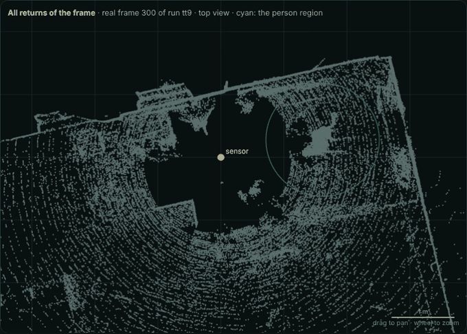

The isolation chain on frame 300 of run tt9 (top view): all returns, candidates closer than the empty room, then each test removing its share (red) until only the person (teal) is left. <b><a href="https://raw.githack.com/cocopops9/human-motion-3d-rf-sim/main/lidar-body-scan/docs/lab/index.html#background">▶ try it live</a></b>

6. **Incomplete frames**: a frame that received less than `min_columns` of its
   columns (UDP packets), or lost more than `max_person_loss` of the columns
   across the person, is not used. A lost packet elsewhere in the 360 deg sweep does
   not matter.

## 5. Turntable fusion (`pipelines.turntable`)

### 5.1 The object on the platform and its axis (`pipelines.common.FindSubject`, `scene.platform`)

`FindTurntableSubject` runs the finder of section 3 on `search_frames` (60)
frames spread over the run, with the tests of `[select]`: by default
`--rotation`, turning about a vertical axis by at least `min_total_turn`
(320°, most of a lap: every side was seen); `--human` adds the person
cascade, `--near X Y` picks the object near a point. Nothing assumes where
the platform is. The object found gives the start of the axis fit (its
rotation axis, a few mm from the final one: 4 mm on tt9) and the region of
section 4. Optionally (`ring_radius` > 0), the ring of a platform (0.5 to 10
cm high) is searched in the empty scene around that axis, and its centre is
used when it lies within `ring_search` of it; without a ring the joint axis
fit of 3.3 measures the axis anyway. `--center X Y` imposes the start (the
object near it is still used for the region), and `--center` with `--radius`
skips the search. If no object passes the tests, `fuse` stops and prints the
table of objects with the reason each one failed.

### 5.2 Frame times (`motion.timing`)

Every frame gets one time on the sensor clock: the mean timestamp of the
person's pixels (continuous even when the person straddles the start of the
sweep). Frames without it use the median timestamp of the sweep; without any
timestamp, the host time mapped onto the sensor clock by a robust line fit.
Mixing the two clocks (host and sensor) produced the "half-moon" fusion of
tt13: frames without the person were placed thousands of seconds away and
every interpolation in time failed.

### 5.3 Platform angle of every frame (`motion`)

Consecutive frames turn by only a fraction of a degree, and the LiDAR samples
the body along the same beams in both, which pulls a registration towards "no
motion". The estimator therefore works with long baselines and few
parameters:

  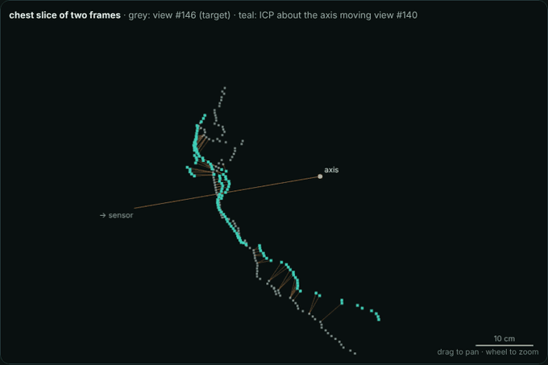
  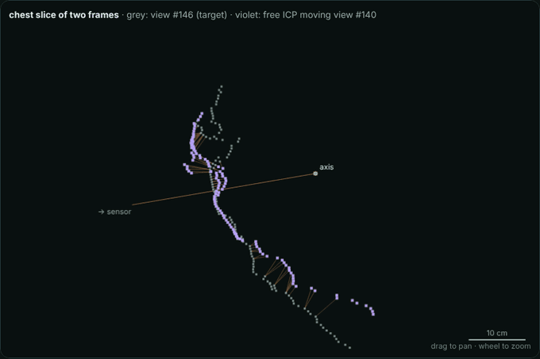

Two real chest slices of the scan, 29° apart (grey: target). Left: ICP with one unknown, the turn about the axis. Right: free ICP (turn and shift), which converges too but reports a sideways shift that does not exist: part of the turn has been explained as a shift. <b><a href="https://raw.githack.com/cocopops9/human-motion-3d-rf-sim/main/lidar-body-scan/docs/lab/index.html#angles">▶ try it live</a></b>

1. **Samples**: one frame every `sample_seconds` (at most `max_samples`).
2. **Chained angles** (`motion.pairs.chained_angles`): neighbouring samples are
   registered with ONE unknown, the turn about the vertical through the
   current axis estimate (`registration.icp_turn_about`, point to plane, Tukey
   weights). A free turn-plus-shift registration of a partial view is
   ambiguous (a small turn looks like a sideways shift); fixing the axis
   removes the ambiguity. These angles find the still parts and the turn.
3. **Long pairs** (`joint_axis_fit`): pairs 20 to 60 deg apart, with one turn
   per pair and the axis position fitted together (Gauss-Newton, Tukey kernel,
   Schur complement for the shared axis). A wrong axis leaves a shift
   (I - R) e that grows with the turn, so the axis is measured to a few mm.

  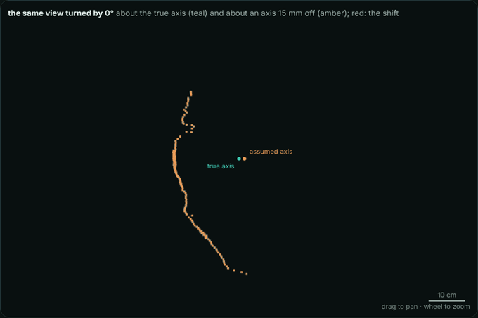
  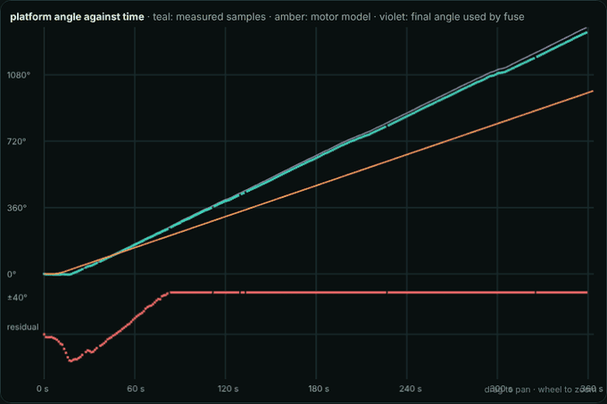

Left: the same view turned about the true axis (teal) and about an axis 15 mm off (amber); the shift (I − R) e grows with the turn, which is why long pairs measure the axis. Right: the trapezoidal stepper model fitted to the real measured angles of the scan (teal dots), with the residuals below. <b><a href="https://raw.githack.com/cocopops9/human-motion-3d-rf-sim/main/lidar-body-scan/docs/lab/index.html#angles">▶ try it live</a></b>

4. **Motion models** (`motion.models`, `motion.fitting`): a stepper model
   (trapezoidal speed profile, ramps, one continuous move or a sequence of
   one-lap moves with short stops, as the MATLAB timer sends them) and a
   model-free solution (the chained angles plus a piecewise linear
   correction) are fitted to all the pairs with Huber weights. Partial views
   read every turn short by 1 to 3 %: the measured turn is modelled as
   (1 + scale) x the true one.
5. **Revisit pairs**: pairs one or more whole laps apart (the body faces the
   same way again) are predicted by the model fitted so far and registered
   with a small search; their whole laps are exact, so they calibrate the
   scale and fix the total turn over many laps.
6. **Boundary pairs**: consecutive frames at the full frame rate around every
   start and stop time the moves.
7. **Correction**: a free-form correction c(t) of the stepper profile (one
   knot every `correction_spacing` s, smoothed) absorbs lost steps and speed
   changes under load.
8. **Choice** (`angle_source auto`): the mean of the motor model and the
   model-free solution when they agree within `model_agreement` (their errors
   are partly independent), else the model-free solution. The angle plot
   (`<out>_angle.png`) shows every solution and the residuals.

  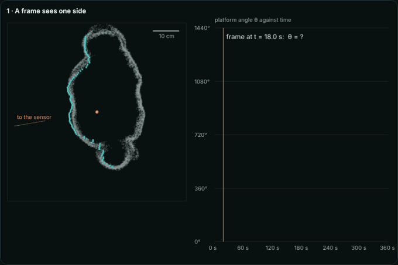

The whole chain on the real scan (chest slice of the 378 views): a frame sees only the side facing the sensor; ICP measures the turn between two frames; chained turns drift (27° after 3.7 laps); the motor model fitted to all pairs gives one angle per frame; every frame is turned back by its angle and the laps land on the same surface; with chained or constant-speed angles (errors up to 25°) the laps disagree and the body is smeared. <b><a href="https://raw.githack.com/cocopops9/human-motion-3d-rf-sim/main/lidar-body-scan/docs/lab/index.html#angles">▶ try it live</a></b>

**How the registrations and the motor model work together.** ICP never
gives an angle, only the turn between two frames, θ(tᵢ) − θ(tⱼ). The angles
of all frames come from a least-squares fit of a curve to all these
differences, and each kind of pair fixes a different error: chained pairs
carry noise that integrates into a random walk and a bias (partial views
read every turn 1 to 3 % short) that accumulates; long pairs remove the
random walk but share the bias; revisit pairs, whole laps apart, are exact
in whole laps and calibrate the bias; the motor model (a curve with a few
parameters plus a smooth correction) fills the places where pairs are weak
or missing. In a simulation with the profile of this scan, chained pairs
alone end 27° short after 3.7 laps (rms error 15°), long pairs bring it to
10°, revisits to 0.2°.

  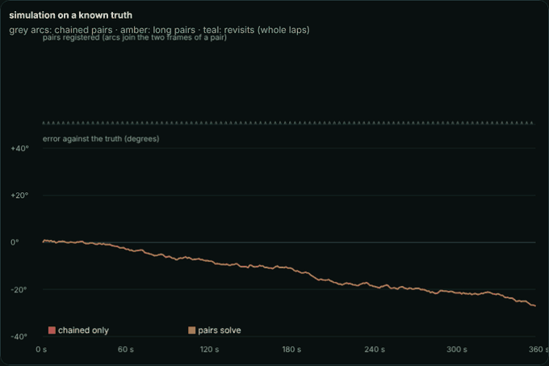

Simulation on a known truth with the stepper profile of this scan: the arcs are the registered pairs; the curves are the error of each solution as the kinds of pairs are added (chained, long, revisits, motor model). <b><a href="https://raw.githack.com/cocopops9/human-motion-3d-rf-sim/main/lidar-body-scan/docs/lab/index.html#angles">▶ try it live</a></b>

### 5.4 Views (`fusion.views`)

One frame every `view_step` degrees of turn becomes a view: its person cloud
turned back by the platform angle about the axis. With per-column timestamps
every point is turned back by the angle at its own time, so the turn during
the 0.1 s sweep is undone too.

  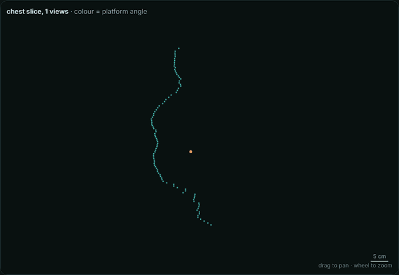

Chest slice through the views of the scan: each view first where the sensor saw it, then turned back by its platform angle until all 378 wrap around the body (colour = platform angle). <b><a href="https://raw.githack.com/cocopops9/human-motion-3d-rf-sim/main/lidar-body-scan/docs/lab/index.html#fusion">▶ try it live</a></b>

### 5.5 Corrections (`fusion.corrections`)

Each correction aligns every view against the views of the other groups
(views split into `reference_groups` random groups; leave one group out), with
bounded motions:

| Correction | What it absorbs |
|---|---|
| axis polish | an axis error e displaces the view at angle θ by (R(θ)ᵀ - I) e; least squares over the views gives e (sway averages out over a lap) |
| sway | a small rigid correction per view (`max_turn_correction`, `max_shift`, `max_tilt`); views out of bounds are dropped (a lost step, or the person moved) |
| slabs | a turn and a shift per horizontal slab, smoothed along the height: lean (it pivots about the ankles), head turn, hips |
| limbs | each free-hanging arm (A-pose) registered on its own, faded out below the shoulder: arms held away from the body sink and swing |

### 5.6 Fusion (`fusion.surface`)

1. **Support filter**: a point is kept if points of at least `min_views` views
   per lap (its own included) lie within `support_radius`: ghosts seen in a
   single view are removed.
2. **Voxel averaging** (`voxel`) of a random subset of one lap of views.
3. **Surface fit**: every output point moves along its normal onto the median
   of the view points within 2 x `confidence_radius`, then within
   `confidence_radius` (all laps). The median is robust to the remaining
   misalignments; more laps make it more precise.
4. **Confidence** of every output point: distinct views, points, and their
   spread along the normal (1.4826 x median absolute deviation). The standard
   error of the fitted surface is about 1.25 x spread / √points.

  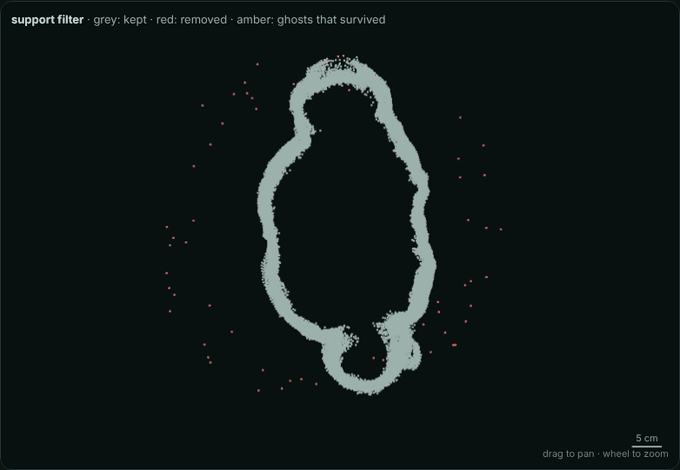
  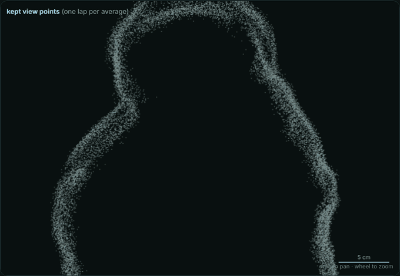

Left: the support filter with <code>min_views</code> from 1 to 8; ghosts seen by a single view (red) disappear first. Right: view points, voxel averages, then the median surface fit coloured by the spread along the normal. <b><a href="https://raw.githack.com/cocopops9/human-motion-3d-rf-sim/main/lidar-body-scan/docs/lab/index.html#fusion">▶ try it live</a></b>

## 6. In-place fusion (`pipelines.inplace`)

1. **Person region**: the person found by the finder of section 3 (by default
   `--human`; `--near X Y` or `--center X Y` to choose among several people)
   and the cylinder it occupies over the run plus `margin`, or a crop box.
2. **Still periods** (`scene.stillness`): per frame, the fraction of person
   pixels that changed (in or out of the person mask, or range change above
   `motion_threshold`). A frame is still when the score stays below
   `still_factor` x its 20th percentile (at most `still_max`) with respect to
   both neighbours; runs of at least `min_still` frames are stops.
3. **Keyframes**: per-pixel median of up to `keyframe_frames` frames at the
   centre of every stop (range noise down, breathing frozen at mid-breath).
4. **Registration** (`registration.keyframes`): every keyframe gets its own
   pose. Consecutive keyframes are registered with a full yaw search, two
   kinds of start per yaw (turn about the estimated body axis and move it onto
   the next one, or turn on the spot); the majority turning sense is enforced;
   skip pairs (k to k+2) catch wrong steps; all overlapping pairs are added; the
   turn of every keyframe is solved from all pairs at once (weighted least
   squares, Huber); model poses are refined pair by pair with bounded
   corrections and a pose graph. A lean up to `max_tilt` is allowed.
5. **Slabs** and **fusion** as in the turntable pipeline.

Synthetic test (16 stops, 1 cm noise): turns within 2.9 deg, fused cloud to
truth median 1.6 mm, p90 5.6 mm.

## 7. Meshing (`pipelines.mesh`, `pipelines.smooth`, `meshing`)

Two commands: `mesh` converts the cloud into a closed mesh (steps 1 to 3, and
the report), `smooth` smooths a closed mesh (step 4). `mesh` contains no
smoothing filter; two of its steps still set the finest detail by
construction: the Poisson octree (`depth` 9: cells of about 4 mm on a
person) and the watertight grid (4 mm). Neither removes bumps larger than
its cell. Upstream, the surface fit of `fuse` already moves every point onto
the median surface of its neighbours (`surface_fit`, radius 10 mm): that is
the denoising of the cloud, before any mesh exists.

1. **Reconstruction**: screened Poisson (octree `depth`) on the fused cloud with
   its outward normals. Other methods (`grid` for a single organized frame,
   ball pivoting, alpha shape) leave open surfaces.

     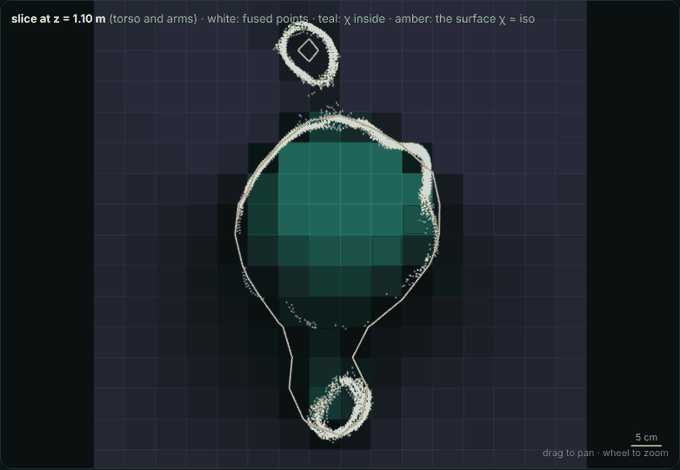
   

   
The Poisson equation solved in 2D on the real slice at arm height, <code>depth</code> 4 to 8 (cells of 50 to 3 mm): the indicator χ (teal inside) and its iso-contour by marching squares. Low depth melts the arms into the torso; high depth follows the noise. <b><a href="https://raw.githack.com/cocopops9/human-motion-3d-rf-sim/main/lidar-body-scan/docs/lab/index.html#poisson">▶ try it live</a></b>

2. **Cleaning and orientation** (`meshing.cleanup`): degenerate, duplicated and
   non-manifold elements removed; the winding made consistent across every
   shared edge (breadth-first), then each connected piece turned so that most
   of its triangles agree with the cloud normals. Triangles are never flipped
   one by one (that left inconsistent patches and, about once in ten runs, a
   doubled surface after step 3).
3. **Watertight remesh** (`meshing.watertight`): a signed distance field on a
   `watertight` grid. Near the surface the distance comes from the closest
   triangle; the sign from ray parity (inside when a majority of 5 rays cross
   the surface an odd number of times), except within half a voxel of the
   surface where the closest point lies inside a triangle: there that
   triangle's normal decides (at an edge or a vertex a neighbour may
   disagree). The winding is checked per connected piece against parity: a
   piece wound inside out is turned, a piece whose normals disagree with
   parity on more than 1 % of the voxels near it takes the parity sign. Far
   from the surface the sign is tested once per 2 x 2 x 2 block (the block is
   more than a voxel from the surface), in slabs, so that a 2 mm grid fits in
   about 2.7 GB of memory (tt16). Marching cubes (`meshing.marching`, with loop centres for the
   ambiguous cases) extracts the zero level set: closed, edge-manifold,
   consistently oriented. Gaps narrower than about 1.5 voxels are sealed;
   bubbles smaller than 1 % are dropped; `clip_below` cuts flat soles.
   An optional quadric decimation (`target_edge_mm`) reduces the triangle
   count; it leaves kinks, which `smooth` then removes.

     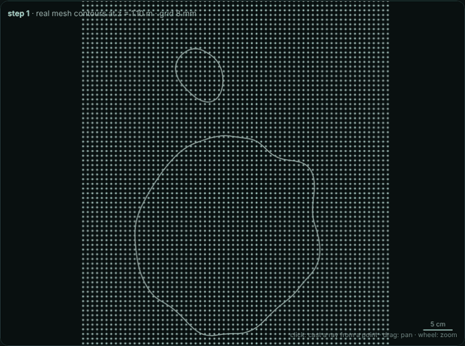
   

   
The watertight remesh step by step on the real mesh contours at z = 1.10 m: the grid, the distance to the surface, the sign by rays sweeping the grid (odd number of crossings: inside), the closed contour extracted at distance 0, then the arm moved towards the torso until the gap is about one cell and the contours merge. <b><a href="https://raw.githack.com/cocopops9/human-motion-3d-rf-sim/main/lidar-body-scan/docs/lab/index.html#watertight">▶ try it live</a></b>

4. **Smoothing** (`bodyscan smooth`, `meshing.smoother`, `meshing.smoothing`):
   Sionna RT reflects a ray on the plane of the triangle it hits (face
   normal). A triangle of edge L whose vertices have an error σ along the
   normal is tilted by about 2σ/L rad, and the reflected ray turns by twice
   the tilt. One round:
   - bilateral normal filtering (Zheng et al. 2011): every face normal is
     replaced by the average of the normals of all the faces within
     2 x `scale_mm`, weighted by area, by distance (Gaussian, σ = `scale_mm`)
     and by the normal difference (σ = `normal_sigma`: 0.35, about 20 deg,
     keeps creases; the default 1.5 is nearly isotropic). The neighbourhoods
     are true radius neighbourhoods (`geometry.RadiusSearch`): a fixed count
     of nearest faces would shrink the filter on fine grids. When a
     neighbourhood holds more than about 96 faces, the faces are grouped by
     grid cell and normal bin (`FilterSources`), which bounds the cost (tt16,
     4 mm grid: the same quality numbers as the exact average);
   - vertex update (Sun et al. 2007, area weighted): the vertices move so that
     the faces agree with the filtered normals. One pass spreads a change by
     about one ring of triangles, so the automatic count is 15 passes on 3.6
     mm edges, times (3.6 mm / edge)² on finer grids and (scale / 12 mm)²
     above 12 mm (at 24 mm, 15 passes leave the surface dimpled);
   - with `keep_volume`, a uniform offset along the vertex normals restores
     the input volume (the filter shrinks curved parts slightly);
   - with `max_deviation_mm` > 0, the excess of every vertex beyond the limit
     from the input surface is averaged over about 1.5 edges and subtracted,
     then a hard clamp guarantees the bound.
   The first round starts with a tangential relaxation (`relax_iterations`)
   that removes the slivers of marching cubes without moving the surface.
   `rounds` rounds at `scale_mm` are followed by `finish_rounds` rounds at
   `finish_scale_mm` when that is smaller: a wide filter removes long bumps
   and leaves small dimples, which the finer one removes. Only vertices
   move: the mesh stays closed and manifold. The distance from the input
   surface is measured after every round and reported.

   

     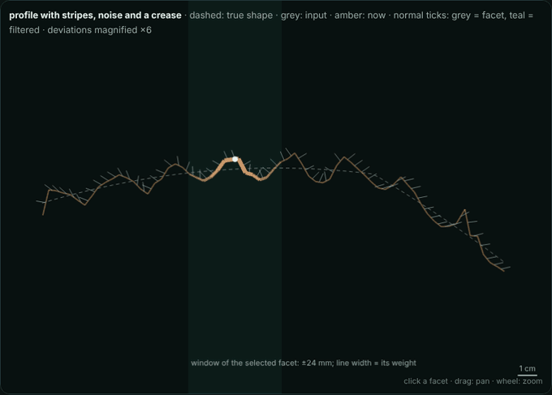
     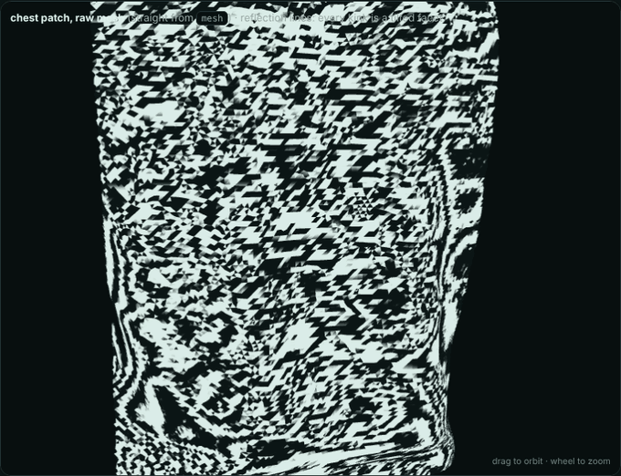
   

   
Left: one round step by step on a profile with stripes, noise and a crease (filter the normals, vertex passes, restore the area; deviations magnified). Right: reflection lines on the real chest patch (29,421 triangles), raw, then 12 mm × 1, × 2, + 2 finishing rounds at 6 mm (level 4), × 4: the scan-row stripes stop breaking the reflections. <b><a href="https://raw.githack.com/cocopops9/human-motion-3d-rf-sim/main/lidar-body-scan/docs/lab/index.html#smoothing">▶ try it live</a></b>

   

     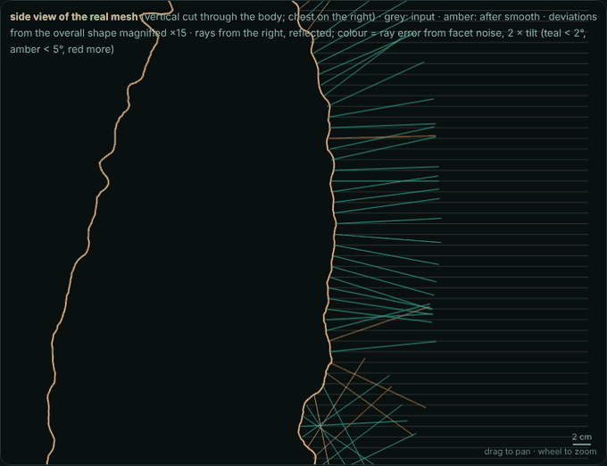
   

   
The real side profile of the <code>pepito</code> mesh (vertical cut, chest on the right; deviations magnified × 15) smoothed with <code>scale_mm</code> 12 and 0 to 12 rounds. Parallel rays from the right are reflected on the facets; their colour is the ray error caused by facet noise. <b><a href="https://raw.githack.com/cocopops9/human-motion-3d-rf-sim/main/lidar-body-scan/docs/lab/index.html#smoothing">▶ try it live</a></b>

5. **Quality report** (`meshing.quality`):

   | Measure | Meaning |
   |---|---|
   | facet normal noise | angle between each face normal and the area-weighted mean normal of all the faces within 1 cm: near 0 on a smooth surface whatever its curvature; it is the random tilt that sends rays astray |
   | dihedral angle | angle between neighbouring faces: curvature plus noise; it shrinks with the triangles, so it compares meshes of the same grid only |
   | bump height rms | residual of the surface around a local quadric (which absorbs the body's curvature), compared with λ/8 (Rayleigh: smaller bumps reflect like a mirror) and λ/32 (Fraunhofer, stricter) |
   | fidelity | distance from the fused cloud to the mesh (`--cloud` for `smooth`): how far the smoothing moved the surface |
   | distance from the input (`smooth`) | distance of every vertex from the input mesh: the shape change |

## 8. Capture (`capture`)

A capture is a list of phases run over the stream of scans (`capture.session`):
`Background` (stored in `background/`), `Countdown` (beeps, nothing stored),
`Hold` (still, phase label 1 or 3), `MotorTurn` (commands sent one after the
other on "T done", label 2), `Stepping` (a beep every few seconds), `Record`
(fixed time or until ENTER). A writer thread stores the frames so that the
acquisition loop never waits for the disk. Replaying a recording uses the
sensor time of the scans as the clock, so a protocol can be tested without
the sensor.

## References

- Q. Zheng, A. Sharf, G. Wan, Y. Li, N. J. Mitra, D. Cohen-Or, B. Chen, "Bilateral normal filtering for mesh denoising", IEEE TVCG 17(10), 2011.
- X. Sun, P. L. Rosin, R. Martin, F. Langbein, "Fast and effective feature-preserving mesh denoising", IEEE TVCG 13(5), 2007.
- M. Kazhdan, H. Hoppe, "Screened Poisson surface reconstruction", ACM TOG 32(3), 2013.
- P. Viola, M. Jones, "Rapid object detection using a boosted cascade of simple features", CVPR 2001.
- W. E. Lorensen, H. E. Cline, "Marching cubes: a high resolution 3D surface construction algorithm", SIGGRAPH 1987.
